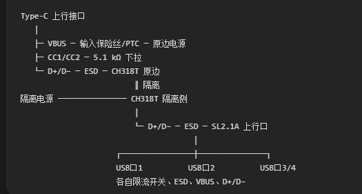
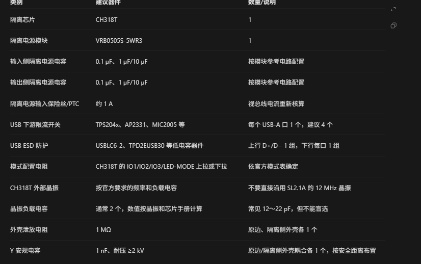

# USB-hub

## 设计框架

### 功能

　　多个USB3.0接口，hdmi接口，type-c接口，Micro‑USB接口、网线接口，TTL转化、串口、I2C、SPI、蓝牙传输、wifi传输接口，同时兼具充电包的功能。支持三种type-c、Micro‑USB、Lightning充电接口，支持tpye-c对type-c、USB转tpye-c输电接口，支持无线传输数据。兼具读卡器功能

## 原理图设计以及芯片使用说明

### 物料清单

1. 1x隔离芯片CH318T
2. 1xtypedc接口U262‑16P‑BH
3. 1x隔离电源模块VRB0505S‑5WR3
4. 1xHUB 芯片SL2.1A
5. 4xusb接口916‑361A1014Y10200
6. - 1x总 PTC：SMD0805B100TF（1A）保护主机
4x 路分口：SMD0805B050TF（0.5A）
7. 2x5.1kΩ 电阻 0805 CC 下拉
8. 2x1MΩ 电阻 0805 外壳泄放电阻 输入外壳、输出外壳各一套
9. 2x1nF Y 安规电容 ≥2kV 高压 Y 电容 和 1MΩ 并联给外壳

### 功能引脚解释
1. typedc接口U262‑16P‑BH
    引脚名	含义	你的项目接法
    GND (A1/B12、B1/A12)	电源地，两组 GND	全部接到 GND_PRI（原边地）
    VBUS (A4/B9、B4/A9)	5V 电源输入，两组 VBUS 并联	全部接到总 PTC 的输入端（电脑输入 5V）
    CC1(A5)、CC2(B5)	配置通道，Type‑C 识别正反插	各串 5.1kΩ 下拉电阻 → GND_PRI，设备模式，不要接副边地！
    DP1(A6)、DN1(A7)	USB2.0 差分信号 D+ / D‑（主通道）	接CH318T 隔离芯片原边 DP/DM；这是唯一要用的 USB 信号
    DP2(B6)、DN2(B7)	USB3.0 高速差分对（SuperSpeed）	❗直接悬空，什么都不接，本项目是 USB2.0，没有 USB3.0 电路
    SBU1(A8)、SBU2(B8)	Sideband Use 辅助信号，用于 USB3.0/DP Alt Mode	❗悬空，不用
    EH(13,14,15,16)	SHELL 金属屏蔽外壳，4 个焊脚内部连通	不要直接接地！并联：1MΩ 电阻 +1nF/2kV 高压 Y 电容 → GND_PRI
2. USB隔离芯片CH318T
    引脚号	引脚名	功能说明
    1	DMX	差分发送 / 接收负信号，接网络变压器差分 DM（接网线隔离变压器）
    2	DPX	差分发送 / 接收正信号，接网络变压器差分 DP（接网线隔离变压器）
    3	XO	晶振输出，20MHz 外部晶振一端，外接 20M 晶体
    4	XI	晶振输入，20MHz 外部晶振另一端，外接 20M 晶体
    5	AVDDK	模拟内核电源，模拟部分供电，3.3V，必须就近接滤波电容到 GND
    6	DMU	USB 上行端口 D‑（上位机模式接电脑 USB D‑；下位机模式是端口 1 D‑）
    7	DPU	USB 上行端口 D+（上位机模式接电脑 USB D+；下位机模式是端口 1 D+）
    8	DM2	USB 第 2 下行端口 D‑，第二个 USB 设备口 D‑
    9	DP2	USB 第 2 下行端口 D+，第二个 USB 设备口 D+
    10	IO1	通用输入输出 GPIO1，模式配置引脚
    11	IO2	通用输入输出 GPIO2，模式配置引脚
    12	IO3	通用输入输出 GPIO3，模式配置引脚；IO1/IO2/IO3 组合选择芯片工作模式：上位 UP 模式 / 下位 DOWN 模式
    13	LED/MODE	LED 输出 / 模式配置脚；输出状态指示灯驱动；也可参与模式配置；接 LED 指示 USB 链路状态
    14	DVDDK	数字内核电源，数字逻辑内核 3.3V 供电，就近 0.1uF 电容接地
    15	GND	全局地，芯片公共参考地
    16	VDD33	芯片主电源输入，3.3V 供电输入引脚
    17‑20	NC	空脚 No Connect，内部无连接，PCB 悬空，不要焊接走线
3. 隔离电源模块VRB0505S‑5WR3
    | 引脚 | 功能 |
    |---:|---|
    | 1 | GND，输入负端 |
    | 2 | Vin，输入正端 |
    | 3 | NC，内部不连接 |
    | 4 | **缺脚/不引出，通常用于爬电距离或机械定位** |
    | 5 | NC，内部不连接 |
    | 6 | +Vo，隔离输出正端 |
    | 7 | 0V，隔离输出负端 |
    | 8 | NC，内部不连接 |
4. HUB 芯片SL2.1A
    | 引脚 | 名称 | 作用 |
    |---:|---|---|
    | 1 | DM4 | 第 4 个下行 USB 端口 D− |
    | 2 | DP4 | 第 4 个下行 USB 端口 D+ |
    | 3 | DM3 | 第 3 个下行 USB 端口 D− |
    | 4 | DP3 | 第 3 个下行 USB 端口 D+ |
    | 5 | DM2 | 第 2 个下行 USB 端口 D− |
    | 6 | DP2 | 第 2 个下行 USB 端口 D+ |
    | 7 | DM1 | 第 1 个下行 USB 端口 D− |
    | 8 | DP1 | 第 1 个下行 USB 端口 D+ |
    | 9 | DM | 上行 USB D−，连接主机或前级隔离器 |
    | 10 | DP | 上行 USB D+，连接主机或前级隔离器 |
    | 11 | VDD5 | 5 V 电源输入，通常为 USB VBUS 或 Hub 电源 |
    | 12 | GND | 芯片地 |
    | 13 | VDD33 | 3.3 V 电源端 |
    | 14 | VDD18 | 1.8 V 内部数字核心电源端，按数据手册接电源/去耦 |
    | 15 | XOUT | 晶振输出端 |
    | 16 | XIN | 晶振输入端 |
5. usb接口916‑361A1014Y10200

6. PTC：SMD0805B100TF

## 
    ════════════════════ 原边：电脑侧 ════════════════════

    J1：USB Type-C（U262-16P-BH）

    A6 DP1 ─┐
            ├── USB_DP_PRI ── ESD1-CH1 ── U1.DPU（7脚）
    B6 DP2 ─┘

    A7 DN1 ─┐
            ├── USB_DM_PRI ── ESD1-CH3 ── U1.DMU（6脚）
    B7 DN2 ─┘

    ESD1：USBLC6-2SC6

    ESD1-1、ESD1-6 ── USB_DP_PRI
    ESD1-3、ESD1-4 ── USB_DM_PRI
    ESD1-2、ESD1-5 ── GND_PRI

    A4、A9、B4、B9 VBUS
            │
            └── VBUS_PRI ── F1/PTC ── +5V_PRI
                                        │
                                    C1 10uF
                                    C2 0.1uF
                                        │
                                    GND_PRI

    A1、A12、B1、B12 GND ───────────── GND_PRI

    A5 CC1 ── R1 5.1kΩ ── GND_PRI
    B5 CC2 ── R2 5.1kΩ ── GND_PRI

    A8 SBU1 ── NC
    B8 SBU2 ── NC

    EH13、EH14、EH15、EH16
            │
            └── USB_SHIELD_PRI
                    ├── R3 1MΩ ── GND_PRI
                    └── C3 1nF / 2kV Y电容 ── GND_PRI

    +5V_PRI ── U3：3.3V LDO ── VDD33_PRI
                                │
                            C4 10uF
                            C5 0.1uF
                                │
                            GND_PRI

    U1：CH318T（上位机模式）

    U1.VDD33（16脚） ── VDD33_PRI

    U1.AVDDK（5脚） ── VDD33_PRI
                    └── C6 1uF ── GND_PRI

    U1.DVDDK（14脚） ── VDD33_PRI
                    └── C7 0.1uF ── GND_PRI

    U1.GND（15脚） ── GND_PRI

    U1.XO（3脚） ─────┐
                    ├── X1：20MHz晶体
    U1.XI（4脚） ─────┘

    U1.XO ── C8 负载电容 ── GND_PRI
    U1.XI ── C9 负载电容 ── GND_PRI

    U1.LED/MODE（13脚） ── R4 5.1kΩ ── VDD33_PRI

    U1.IO1（10脚） ── NC
    U1.IO2（11脚） ── NC
    U1.IO3（12脚） ── NC
    U1.DM2（8脚）  ── NC
    U1.DP2（9脚）  ── NC
    U1.NC（17～20脚） ── 悬空

    ════════════════════ 电气隔离区 ════════════════════

    U1.DPX（2脚） ── C10 0.1uF / 2kV ── U2.DPX（2脚）

    U1.DMX（1脚） ── C11 0.1uF / 2kV ── U2.DMX（1脚）

    C10、C11：

    类型：高频高压陶瓷电容
    容量：0.022uF～0.47uF，推荐0.1uF
    耐压：不低于2kV

    DPX 对 DPX，DMX 对 DMX，不能交叉。

    ════════════════════ 隔离电源部分 ════════════════════

    U4：VRB0505S-5WR3

    +5V_PRI ───────── U4.IN+
    GND_PRI ───────── U4.IN-

    U4.OUT+ ───────── +5V_ISO
    U4.OUT- ───────── GND_ISO

    U4.IN+ 与 U4.IN- 之间：

    C12 10uF
    C13 0.1uF

    U4.OUT+ 与 U4.OUT- 之间：

    C14 10uF
    C15 0.1uF

    注意：

    GND_PRI 与 GND_ISO 不连接
    +5V_PRI 与 +5V_ISO 不直接连接

    ════════════════════ 隔离侧：设备侧 ════════════════════

    +5V_ISO ── U5：3.3V LDO ── VDD33_ISO
                                │
                            C16 10uF
                            C17 0.1uF
                                │
                            GND_ISO

    U2：CH318T（下位机模式）

    U2.VDD33（16脚） ── VDD33_ISO

    U2.AVDDK（5脚） ── VDD33_ISO
                    └── C18 1uF ── GND_ISO

    U2.DVDDK（14脚） ── VDD33_ISO
                    └── C19 0.1uF ── GND_ISO

    U2.GND（15脚） ── GND_ISO

    U2.XO（3脚） ─────┐
                    ├── X2：20MHz晶体
    U2.XI（4脚） ─────┘

    U2.XO ── C20 负载电容 ── GND_ISO
    U2.XI ── C21 负载电容 ── GND_ISO

    U2.LED/MODE（13脚） ── R5 5.1kΩ ── GND_ISO

    U2.IO1（10脚） ── NC
    U2.IO2（11脚） ── NC
    U2.IO3（12脚） ── NC
    U2.DM2（8脚）  ── NC
    U2.DP2（9脚）  ── NC
    U2.NC（17～20脚） ── 悬空

    U2.DMU（6脚） ── USB_DM_ISO ── ESD2-CH3 ── SL2.1A.DM（9脚）

    U2.DPU（7脚） ── USB_DP_ISO ── ESD2-CH1 ── SL2.1A.DP（10脚）

    ESD2：USBLC6-2SC6

    ESD2-1、ESD2-6 ── USB_DP_ISO
    ESD2-3、ESD2-4 ── USB_DM_ISO
    ESD2-2、ESD2-5 ── GND_ISO

    +5V_ISO ───────── SL2.1A.VDD5（11脚）
    GND_ISO ───────── SL2.1A.GND（12脚）